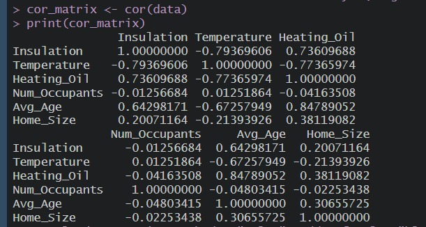

```{=html}
<style>
body{
text-align: justify}
</style>
```
```{r setup, include=FALSE}
knitr::opts_chunk$set(echo = TRUE)
```

# UTS-Regression Model 

## Soal 1
### Langkah 1 Buat Correlation Matrix

```{r, message=FALSE, warning=FALSE}
suppressPackageStartupMessages({
  library(ggplot2)
  library(corrplot)
  library(readr)
  library(dplyr)
})

data <- read_csv("HeatingOil.csv")

cor_matrix <- cor(data)
print(cor_matrix)
corrplot(cor_matrix, method = "color", addCoef.col = "black", tl.cex = 0.6)


```


### Langkah 2 Interpretasi Correlation Matrix




Berdasarkan matriks korelasi, variabel yang memiliki hubungan kuat dengan Heating_Oil adalah:

1. Avg_Age memiliki korelasi positif sangat kuat sebesar +0.8479. Artinya, rumah dengan penghuni yang lebih tua cenderung mengonsumsi lebih banyak Heating_Oil. Hal ini logis, karena lansia biasanya lebih sensitif terhadap suhu dingin dan lebih sering membutuhkan pemanas.
2. Temperature menunjukkan korelasi negatif kuat sebesar -0.7737. Semakin tinggi suhu lingkungan, konsumsi Heating_Oil cenderung menurun. Ini sangat masuk akal karena pada suhu yang lebih hangat, pemanas tidak terlalu dibutuhkan.
3. Insulation menunjukkan korelasi positif kuat sebesar +0.7361, yang secara teori agak tidak biasa. Seharusnya isolasi yang baik menurunkan konsumsi pemanas. Hasil ini bisa jadi disebabkan oleh kualitas data, variabel lain yang memengaruhi, atau bahkan efek confounding yang belum teridentifikasi.
4. Home_Size memiliki korelasi positif sedang sebesar +0.3811. Rumah yang lebih besar cenderung menggunakan lebih banyak Heating_Oil, kemungkinan karena ruang yang lebih luas memerlukan energi pemanas lebih banyak.
5. Num_Occupants hanya menunjukkan korelasi negatif sangat lemah sebesar -0.0416, yang berarti hampir tidak ada hubungan antara jumlah penghuni dengan konsumsi Heating_Oil. Variabel ini bisa dianggap tidak signifikan dalam konteks ini.

Kesimpulan
Faktor yang paling memengaruhi konsumsi Heating_Oil dalam data ini adalah:

1. Usia penghuni rumah (Avg_Age)

2. Suhu lingkungan (Temperature)

3. Ukuran rumah (Home_Size)

Langkah 3: Scatter Plot 1
Plot ini dibuat untuk melihat apakah terdapat hubungan antara **usia rata-rata penghuni rumah** (`Avg_Age`) dengan **jumlah konsumsi minyak pemanas** (`Heating_Oil`). Warna titik digunakan untuk menunjukkan intensitas konsumsi Heating_Oil, dari biru (rendah) ke merah (tinggi).

```{r}
ggplot(data, aes(x = Heating_Oil, y = Avg_Age, color = Heating_Oil)) +
  geom_point() +
  scale_color_gradient(low = "blue", high = "red") +
  theme_minimal() +
  labs(title = "Heating Oil vs Avg Age", x = "Heating Oil", y = "Avg Age")

```

Terdapat hubungan yang cukup kuat antara usia rata-rata penghuni rumah dan jumlah konsumsi Heating_Oil. Visualisasi ini mendukung hasil correlation matrix sebelumnya (dengan nilai korelasi sekitar +0.85) dan memperkuat dugaan bahwa faktor demografis seperti usia dapat memengaruhi kebiasaan konsumsi energi rumah tangga.

### Langkah 4: Scatter Plot 2
```{r}
ggplot(data, aes(x = Temperature, y = Insulation, color = Heating_Oil)) +
  geom_point() +
  scale_color_viridis_c(option = "plasma") +
  theme_minimal() +
  labs(title = "Temperature vs Insulation (colored by Heating Oil)",
       x = "Temperature", y = "Insulation")
```

Berdasarkan plot yang menggunakan skema warna viridis, terlihat bahwa pada suhu yang lebih tinggi dan insulasi yang lebih rendah, konsumsi Heating_Oil justru cenderung rendah, yang ditunjukkan dengan warna ungu hingga biru (nilai rendah). Sebaliknya, pada kondisi suhu rendah meskipun insulasi tinggi, warna titik berubah menjadi orange hingga kuning terang yang mengindikasikan konsumsi Heating_Oil tinggi. Hal ini menunjukkan bahwa insulasi memang membantu mengurangi penggunaan energi, tetapi tidak cukup efektif apabila suhu lingkungan sangat rendah. Sementara itu, pada suhu yang lebih hangat, kebutuhan pemanasan tetap rendah meskipun tanpa insulasi yang optimal. Dengan kata lain, pengaruh suhu terhadap konsumsi energi lebih dominan dibandingkan insulasi dalam konteks ini.

### Langkah 5: Rekomendasi untuk Sarah
Berdasarkan hasil analisis data, saya menyarankan agar Sarah memfokuskan promosi Heating_Oil pada rumah tangga dengan penghuni lansia, karena terdapat korelasi positif yang sangat kuat (+0.85) antara usia penghuni dan konsumsi minyak pemanas. Selain itu, wilayah dengan suhu rendah juga perlu menjadi fokus utama, mengingat korelasi negatif yang kuat (-0.77) antara suhu dan konsumsi Heating_Oil, yang menunjukkan bahwa permintaan akan lebih tinggi di wilayah tersebut. Selain itu, rumah dengan isolasi buruk (korelasi positif +0.74) perlu menjadi target, terutama rumah yang belum direnovasi secara termal. Saya juga berpikir Sarah bisa membuat segmentasi berdasarkan ukuran rumah (+0.38), dengan menawarkan paket khusus untuk pemilik rumah besar yang lebih banyak mengonsumsi energi pemanas. Strategi ini bisa membantu menjangkau pasar yang lebih tepat sasaran.


## Soal 2
### Tugas Sarah (Membuat & Menyimpan Model)
```{r}
# File Sarah_build_model.R
heating_oil_data <- read.csv("HeatingOil.csv")

# Gunakan variabel yang sesuai dari dataset
model <- lm(Heating_Oil ~ Insulation + Temperature + Avg_Age + Home_Size, 
            data = heating_oil_data)

# Simpan model
saveRDS(model, "heating_oil_model.rds")
```
### Tugas Marketer (Memprediksi Data Baru)
```{r}
# Langkah 1: Muat model yang sudah disimpan Sarah
model <- readRDS("heating_oil_model.rds")  # Pastikan file model ada di folder yang sama

# Langkah 2: Baca data calon pelanggan baru
new_data <- read.csv("HeatingOil-Marketing.csv")  

# Langkah 3: Validasi kolom (pastikan sesuai dengan model)
required_cols <- c("Insulation", "Temperature", "Avg_Age", "Home_Size")  # Sesuaikan dengan variabel di model
if (!all(required_cols %in% colnames(new_data))) {
  stop("ERROR: Kolom di data baru tidak sesuai dengan model! Periksa nama kolom.")
}

# Langkah 4: Prediksi kebutuhan minyak
new_data$Predicted_Heating_Oil <- predict(model, newdata = new_data)

# Langkah 5: Simpan hasil (opsional)
write.csv(new_data, "hasil_prediksi_pelanggan_baru.csv", row.names = FALSE)

# Langkah 6: Tampilkan hasil prediksi
head(new_data[, c("Insulation", "Temperature", "Predicted_Heating_Oil")], 10)  # Contoh tampilan

```
#### Visualisasi Prediksi
```{r plot_prediksi, message=FALSE, warning=FALSE}
ggplot(new_data, aes(x = 1:nrow(new_data), y = Predicted_Heating_Oil)) +
  geom_point(color = "steelblue", size = 2) +
  labs(
    title = "Prediksi Kebutuhan Minyak Pemanas per Pelanggan",
    x = "Index Pelanggan",
    y = "Prediksi Heating Oil (gallons)"
  ) +
  theme_minimal()

```

